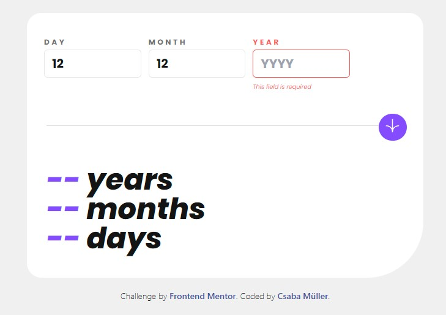

# Frontend Mentor - Age calculator app solution

This is a solution to the [Age calculator app challenge on Frontend Mentor](https://www.frontendmentor.io/challenges/age-calculator-app-dF9DFFpj-Q). Frontend Mentor challenges help you improve your coding skills by building realistic projects. 

### Screenshot

### Links

- Solution URL: [GitHUB](https://github.com/Csabooo/frontendmentor-13-age-calculator-app-HTML-TailwindCSS-JS)
- Live Site URL: [GitHUB Pages](https://csabooo.github.io/frontendmentor-13-age-calculator-app-HTML-TailwindCSS-JS)

## My process

### Built with

- Semantic HTML5 markup
- CSS custom properties
- Javascript
- Tailwind CSS
- Flexbox
- CSS Grid
- Mobile-first workflow

## Author

- Website - [Portfolio](https://csabooo.github.io/portfolio/)
- Frontend Mentor - [@Csabooo](https://www.frontendmentor.io/profile/Csabooo)

